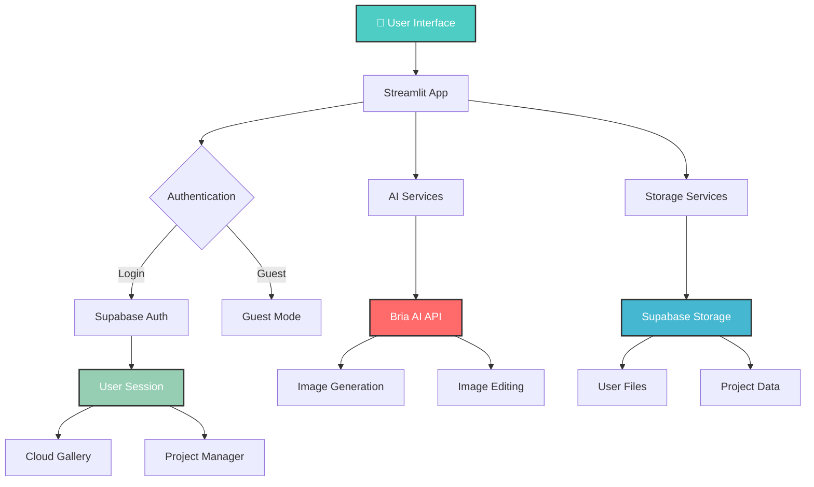

# 🎨 Stencil - Professional AI Image Editor

<div align="center">
  
  [](https://streamlit.io)
  [](https://bria.ai)
  [](https://supabase.com)
  [](https://python.org)
  

  
  *Create stunning visuals with cutting-edge AI-powered image generation and editing!*
  
</div>

## 🌟 Features

<div align="center">
  
  | 🎨 **AI Generation** | 🖼️ **Product Photography** | ✨ **Smart Editing** |
  |:---------------------:|:----------------------:|:--------------------------:|
  | Text-to-image with Bria AI | Professional packshots | Generative fill & erase |
  | Prompt enhancement | Lifestyle shots | Real-time filters |
  
  | 📝 **Text Overlay** | ☁️ **Cloud Storage** | 🔐 **User Authentication** |
  |:----------------------:|:-----------------------:|:---------------------------:|
  | Custom text on images | Save to cloud gallery | Secure login with Supabase |
  | Full style control | Project management | Guest mode available |
  
</div>

## ✨ What makes Stencil special?

- **🎨 AI-Powered Generation** - Create stunning images from text descriptions using Bria AI's latest models
- **🖼️ Professional Product Photography** - Transform product photos with packshots, shadows, and lifestyle contexts
- **✨ Advanced Editing Tools** - Generative fill, element erasing, filters, and text overlays
- **☁️ Cloud-Integrated** - Save images and projects to cloud storage with Supabase
- **🔐 User Authentication** - Secure login system with session management and preferences
- **📁 Project Management** - Save, load, and manage multiple editing projects
- **🎯 Smart Prompt Enhancement** - AI-powered prompt optimization for better results
- **🎨 Modern UI** - Beautiful gradient-themed interface with dark mode aesthetics
- **📱 Responsive Design** - Works seamlessly across desktop and mobile devices


## 🛠️ Tech Stack

<div align="center">
  
  
  
  
  
  
  
</div>

### Core Technologies

- **Web Framework**: Streamlit (Interactive web application with real-time updates)
- **AI Engine**: Bria AI (Advanced image generation and manipulation)
- **Database & Auth**: Supabase (PostgreSQL database with built-in authentication)
- **Cloud Storage**: Supabase Storage (Secure file storage with RLS)
- **Image Processing**: Pillow (PIL) (Python Imaging Library)
- **Drawing Canvas**: streamlit-drawable-canvas (Interactive mask drawing)
- **Session Management**: extra-streamlit-components (Cookie-based persistence)

## 💡 How It Works

### System Architecture



### Processing Pipeline

1. **🔐 Authentication** - User logs in via Supabase or continues as guest
2. **🎨 Image Generation** - User enters prompt, optionally enhanced by AI
3. **⚙️ API Processing** - Request sent to Bria AI with chosen parameters
4. **🖼️ Result Delivery** - Generated/edited image displayed in interface
5. **☁️ Cloud Storage** - Images saved to Supabase Storage (if authenticated)
6. **📁 Project Management** - Complete sessions saved as projects
7. **🔄 Session Persistence** - State maintained via cookies for returning users

## 🎮 Key Features Breakdown

### 🎨 AI Image Generation
- **Text-to-Image**: Generate images from detailed text descriptions
- **Prompt Enhancement**: AI-powered prompt optimization for better results
- **Style Control**: Choose from 8+ artistic styles (Realistic, Artistic, Cartoon, etc.)
- **Aspect Ratios**: Support for 1:1, 16:9, 9:16, 4:3, 3:4
- **Advanced Settings**: Control seed, refinement steps, and guidance scale
- **Batch Generation**: Create up to 4 variations at once

### 🖼️ Product Photography
- **Professional Packshots**: Remove backgrounds and add solid colors
- **Shadow Effects**: Natural and drop shadows with full customization
- **Lifestyle Shots**: Place products in AI-generated environments
  - Text-based scene generation
  - Reference image-based generation
  - Multiple placement options (automatic, manual, custom coordinates)
- **Background Removal**: Force background removal for clean product shots

### ✨ Smart Editing Tools
- **Generative Fill**: Draw a mask and describe what to generate
  - Supports negative prompts
  - Reproducible with seed control
  - Batch generation of variations
- **Element Erasing**: Remove unwanted elements from images
- **Image Filters**: Apply professional filters
  - Grayscale, Sepia, Vintage
  - High Contrast, Brightness adjustments
  - Blur, Sharpen, Edge Enhance
- **Fine-tune Controls**: Adjust brightness, contrast, saturation, sharpness

### 📝 Text Overlay
- **Custom Text**: Add any text to images
- **Style Control**: Customize font size (10-200px) and color
- **Position Presets**: 7 preset positions + custom coordinates
  - Center, Top/Bottom Left/Center/Right
  - Pixel-perfect custom positioning
- **Real-time Preview**: See results instantly

### ☁️ Cloud Storage & Projects
- **User Gallery**: All saved images in one place
- **Cloud Sync**: Access images from any device
- **Project Management**: Save complete editing sessions
  - Full state preservation
  - Multiple projects support
  - Auto-save functionality
- **File Management**: Delete unwanted files from gallery

### 🔐 User Authentication
- **Secure Login**: Email/password authentication via Supabase
- **User Registration**: Create account with email confirmation
- **Session Persistence**: Remember me with secure cookies
- **Guest Mode**: Try features without registration
- **User Preferences**: Customizable default settings
  - Default style and aspect ratio
  - Auto-save preferences
  - Theme settings

## 🚀 Quick Start

### Prerequisites

```bash
# Python 3.9 or higher
python --version

# pip package manager
pip --version
```

### Installation

**1. Clone the repository**
   ```bash
   git clone https://github.com/yourusername/stencil.git
   cd stencil
   ```

**2. Install dependencies**
   ```bash
   pip install -r requirements.txt
   ```

**3. Set up environment variables**
   
   Create a `.env` file in the root directory:
   
   ```bash
   # Bria AI API Key (Required)
   BRIA_API_KEY=your_bria_api_key_here
   
   # Supabase Configuration (Optional - for auth & storage)
   SUPABASE_URL=your_supabase_project_url
   SUPABASE_KEY=your_supabase_anon_key
   ```
   
   **Getting API Keys:**
   - **Bria AI**: Sign up at [Bria AI](https://bria.ai) to get your API key
   - **Supabase**: Create a project at [Supabase](https://supabase.com) for authentication and storage

**4. Set up Supabase (Optional)**
   
   If using authentication and cloud storage, create the following tables in your Supabase project:
   
   ```sql
   -- User preferences table
   CREATE TABLE user_preferences (
     id UUID DEFAULT uuid_generate_v4() PRIMARY KEY,
     user_id UUID REFERENCES auth.users(id) ON DELETE CASCADE,
     default_style TEXT DEFAULT 'Realistic',
     default_aspect_ratio TEXT DEFAULT '1:1',
     theme TEXT DEFAULT 'dark',
     auto_save BOOLEAN DEFAULT true,
     created_at TIMESTAMP WITH TIME ZONE DEFAULT NOW(),
     updated_at TIMESTAMP WITH TIME ZONE DEFAULT NOW(),
     UNIQUE(user_id)
   );
   
   -- Projects table
   CREATE TABLE projects (
     id UUID DEFAULT uuid_generate_v4() PRIMARY KEY,
     user_id UUID REFERENCES auth.users(id) ON DELETE CASCADE,
     name TEXT NOT NULL,
     data JSONB NOT NULL,
     thumbnail_url TEXT,
     created_at TIMESTAMP WITH TIME ZONE DEFAULT NOW(),
     updated_at TIMESTAMP WITH TIME ZONE DEFAULT NOW()
   );
   
   -- Create a storage bucket for user files
   INSERT INTO storage.buckets (id, name, public) 
   VALUES ('user-files', 'user-files', true);
   
   -- Enable RLS (Row Level Security)
   ALTER TABLE user_preferences ENABLE ROW LEVEL SECURITY;
   ALTER TABLE projects ENABLE ROW LEVEL SECURITY;
   
   -- RLS Policies
   CREATE POLICY "Users can view own preferences" ON user_preferences
     FOR SELECT USING (auth.uid() = user_id);
   
   CREATE POLICY "Users can insert own preferences" ON user_preferences
     FOR INSERT WITH CHECK (auth.uid() = user_id);
   
   CREATE POLICY "Users can update own preferences" ON user_preferences
     FOR UPDATE USING (auth.uid() = user_id);
   
   CREATE POLICY "Users can view own projects" ON projects
     FOR SELECT USING (auth.uid() = user_id);
   
   CREATE POLICY "Users can insert own projects" ON projects
     FOR INSERT WITH CHECK (auth.uid() = user_id);
   
   CREATE POLICY "Users can update own projects" ON projects
     FOR UPDATE USING (auth.uid() = user_id);
   
   CREATE POLICY "Users can delete own projects" ON projects
     FOR DELETE USING (auth.uid() = user_id);
   
   -- Storage policies
   CREATE POLICY "Users can upload own files" ON storage.objects
     FOR INSERT WITH CHECK (bucket_id = 'user-files' AND auth.uid()::text = (storage.foldername(name))[1]);
   
   CREATE POLICY "Users can view own files" ON storage.objects
     FOR SELECT USING (bucket_id = 'user-files' AND auth.uid()::text = (storage.foldername(name))[1]);
   
   CREATE POLICY "Users can delete own files" ON storage.objects
     FOR DELETE USING (bucket_id = 'user-files' AND auth.uid()::text = (storage.foldername(name))[1]);
   ```

**5. Run the application**
   ```bash
   streamlit run app.py
   ```

**6. Open your browser**
   - Navigate to `http://localhost:8501`
   - Login or continue as guest
   - Start creating amazing images!

## 🤝 Contributing

Contributions are welcome to enhance Stencil!

1. **🍴 Fork the repository**

2. **🌟 Create your feature branch**
   ```bash
   git checkout -b feature/AmazingFeature
   ```

3. **💻 Commit your changes**
   ```bash
   git commit -m 'Add some AmazingFeature'
   ```

4. **🚀 Push to the branch**
   ```bash
   git push origin feature/AmazingFeature
   ```

5. **📬 Open a Pull Request**

### Development Guidelines

- Follow PEP 8 style guidelines for Python code
- Add docstrings to all functions and classes
- Test new features thoroughly before submitting
- Update documentation for any new features
- Keep commits focused and atomic

## 🎓 Educational Value

This project demonstrates key concepts in:

- **Full-Stack Web Development**: Streamlit for rapid UI development
- **API Integration**: RESTful API consumption with proper error handling
- **Cloud Services**: Authentication, database, and storage with Supabase
- **Image Processing**: PIL/Pillow for image manipulation
- **State Management**: Session state and cookie-based persistence
- **User Experience**: Modern UI/UX with responsive design
- **Security**: Authentication, RLS policies, and secure data handling
- **Project Architecture**: Clean separation of concerns (UI, services, utilities)

## 🔒 Privacy & Security

- **Local Processing**: Basic image operations happen locally
- **Secure API Communication**: HTTPS for all API requests
- **Row Level Security**: Supabase RLS ensures data isolation
- **Password Hashing**: Supabase handles secure password storage
- **Session Management**: Encrypted tokens for authentication
- **User Data Control**: Full control over saved images and projects
- **Guest Mode**: Try features without providing personal information

## 📮 Environment Variables Reference

```bash
# Required
BRIA_API_KEY=your_bria_api_key          # Get from bria.ai

# Optional (for auth & storage features)
SUPABASE_URL=https://xxx.supabase.co    # Supabase project URL
SUPABASE_KEY=your_anon_key              # Supabase anonymous key
```


## 🔮 Future Roadmap

- 🌍 **Multi-Language Support** - Internationalization for global users
- 🎥 **Video Generation** - Extend to video editing capabilities
- 🤖 **AI Assistants** - Chatbot for guided image creation
- 📱 **Mobile App** - Native iOS and Android applications
- 🔗 **Third-Party Integrations** - Shopify, WordPress plugins
- 🎨 **Custom Models** - Fine-tune models on user datasets
- 📊 **Analytics Dashboard** - Usage statistics and insights
- 💼 **Team Collaboration** - Share projects with team members
- 🎭 **Advanced Filters** - More artistic and professional filters
- ⚡ **Batch Processing** - Process multiple images simultaneously


---

<div align="center">
  
  **Made with ❤️ by developers, for creators**
  
  *Empowering creativity through AI*
  
  ⭐ **Star this repo if you found it helpful!** ⭐
  
</div>

---

*Last updated: January 2026*